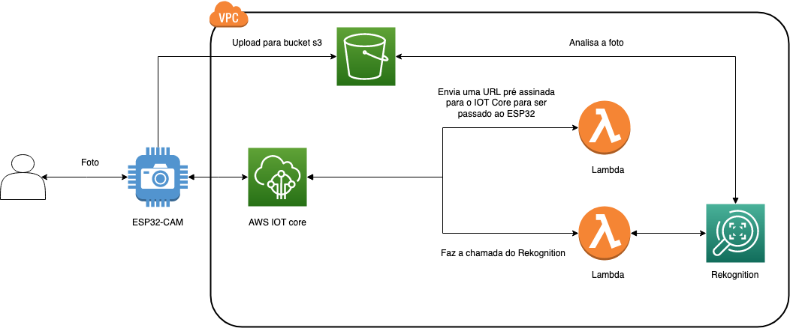

# Computação Fisica - EACH

João Guilherme da Cost Seike nUSP 9784634
Nathan Santos
Ailtom Nunes

## Descrição ##

No momento delicado em que vivemos, o uso de máscara em ambientes fechados é indispensável, não é incomum encontrarmos estabelecimentos em que encarregam um funcionário para checar o uso de máscaras por parte dos clientes, isso é um problema pois restringe esse funcionário a essa função que não gera real valor para o negócio. Nosso projeto tem como objetivo criar um device capaz de utilizar inteligência artificial afim de identificar de forma automática pessoas que não estão usando máscaras de proteção e disparar um alarme visual e sonoro quando for identificado que uma pessoa está sem máscara, e tudo isso de forma barata, sem a necessidade de comprar sensores e totens gigantes como vemos em shoppings, sendo assim uma boa alternativa para pequenos negócios.

## Componentes

**Hardware**:

*ESP32 CAM*: O microcontrolador ESP32 é uma solução altamente integrada para aplicativos Wi-Fi e Bluetooth IoT, com cerca de 20 componentes externos. Neste exemplo, usamos a variante AI Thinker ESP32-CAM que vem com um módulo de câmera OV2640. Este módulo é um sensor de imagem CMOS de baixa voltagem que fornece funcionalidade total de uma câmera UXGA (1632 × 1232) de chip único e processador de imagem em um pacote compacto.

Utilizaremos o a IDE Arduino para programarmos nosso microcontrolador ESP32-CAM.

Outros materiais:

* USB – TTL Serial Adapter
* Breadboard
* 2x LEDs
* 2x 330 Ohm resistors
* Fios de Jumper
 

**Software**

Utilizaremos a AWS para manter uma alta disponibilidade, segurança e performance no nosso projeto, além de mantermos custos baixos pois pagaremos somente pelo que utilizarmos (não teremos problemas de sub utilização de recursos).
Iremos consumir uma API chamada Rekognition, na qual poderemos treinar o modelo a partir de nossas fotos para reconhecimento da presença ou não de máscaras em um rosto humano. https://aws.amazon.com/rekognition/.

Com funções lambdas, podemos executar códigos a partir de gatilhos, como por exemplo o envio de imagens da nossa camera para nosso serviço de storage.https://aws.amazon.com/lambda/

O IOT core permite a publicação e assinatura de tópicos MQTT. Isso significa que o dispositivo pode enviar qualquer informação arbitrária ao AWS IoT Core ao mesmo tempo em que pode receber comandos de volta.https://aws.amazon.com/iot-core/

E por fim, para armazenarmos imagens , usaremos o S3, um serviço de storage na nuvem. https://aws.amazon.com/s3/

## Arquitetura ##
 **esboço da arquitetura em alto nível:**
  
 
 **Diagrama de conexões dos componentes e nosso ESP32:**
  TBD
 
 
